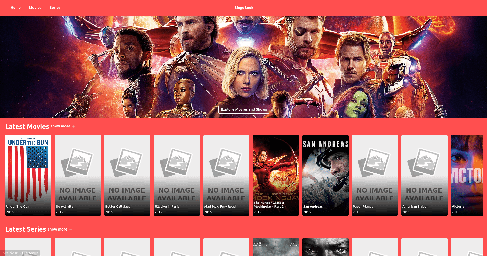
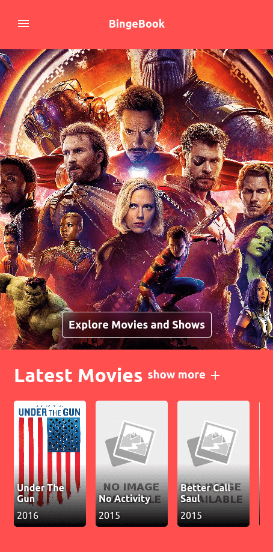
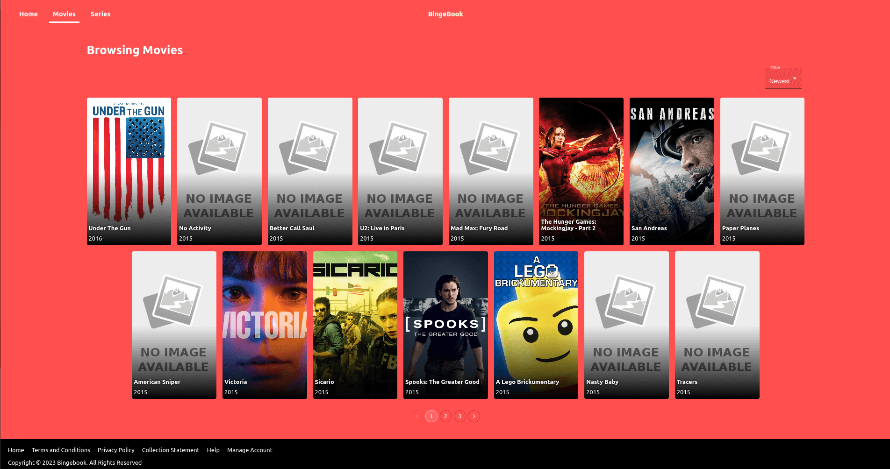
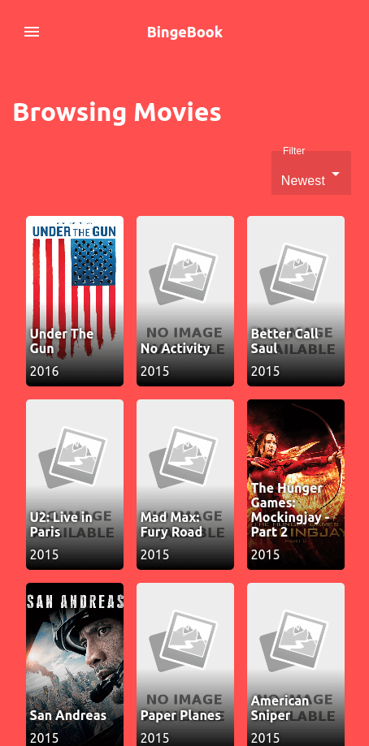
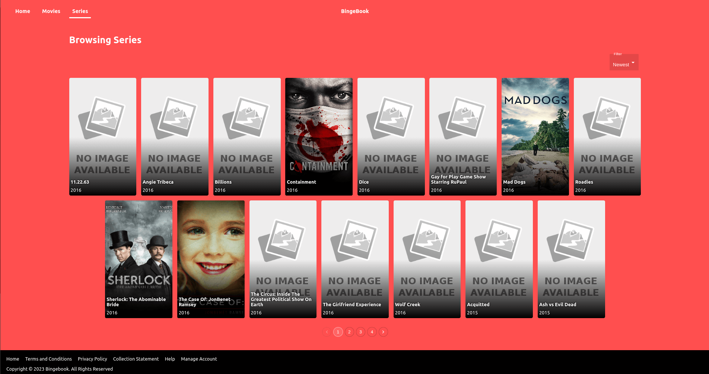
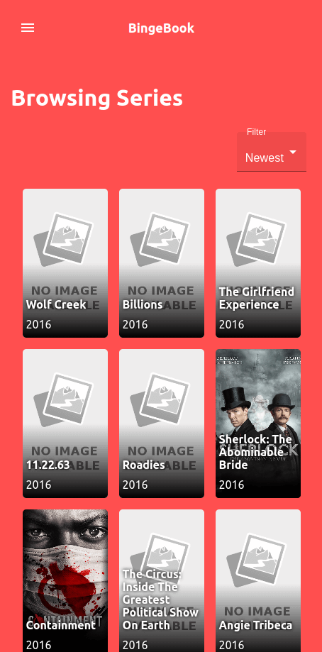
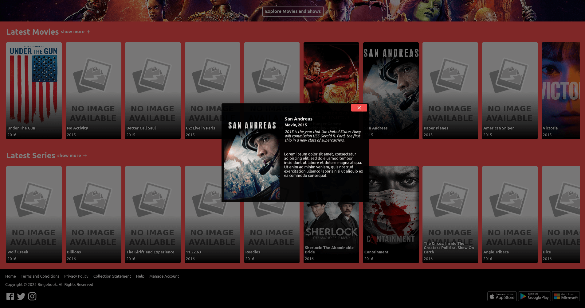
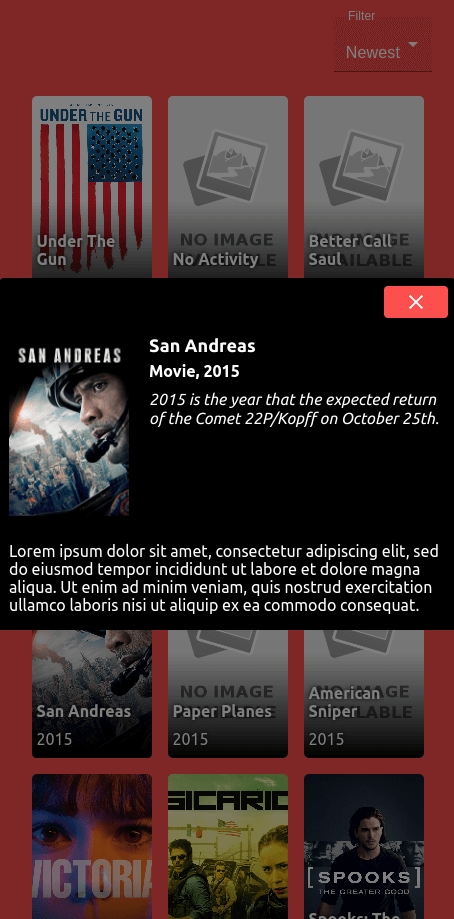
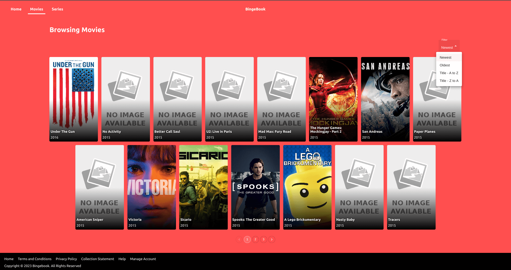
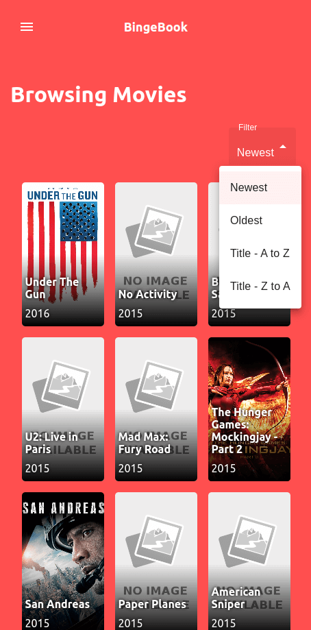

# Technical assignment: Web application - BingeBook 

## Task
- Create <b>Movie Title Listing</b> service
- Expected time to complete ~1 week (given ~5 days)
- Features:
    - Home Page
    - Series Page (pop up modal to show program details)
    - Movies Page (pop up modal to show program details)
- Build set of React components
- Use provided JSON file
- Some of the provided img URLs are dead, make it clear that the image is missing 
- Use API endpoint (http://numbersapi.com/) to retrieve facts about the release year
- Make it clear that the API call is loading, failed, successful

## Bonus
- Testable code using Jest
- Use state management tools like Redux
- Use es6/es2020 JavaScrip features
- Use functional components
- Use 3rd party UI libraries like Material UI

## Homepage

Desktop            |  Mobile
:-------------------------:|:-------------------------:
 |  

## Movies Page

Desktop            |  Mobile
:-------------------------:|:-------------------------:
 |  

## Series Page

Desktop            |  Mobile
:-------------------------:|:-------------------------:
 |  

## Modal

Desktop            |  Mobile
:-------------------------:|:-------------------------:
 |  

## Filter

Desktop            |  Mobile
:-------------------------:|:-------------------------:
 |  

## Mockups
### Open image in a separate window and zoom in (large file ~26 MB)

## Videos

- Desktop version video  
<video controls>
  <source src="media/desktop.mp4" type="video/mp4">
</video>

- Mobile version video  
<video controls>
  <source src="media/mobile.mp4" type="video/mp4">
</video>
